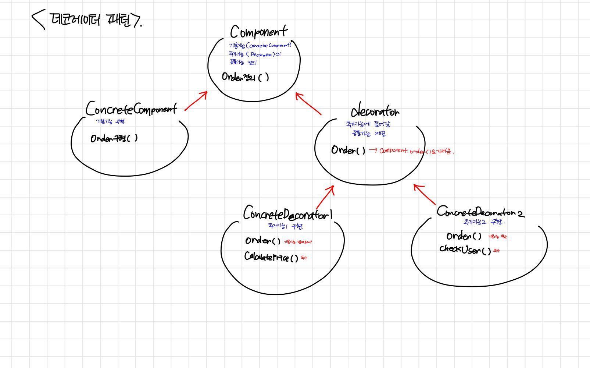

## 🌟 Decorator pattern

### 🎯 데코레이터 패턴이란?
객체에 추가적인 요소들을 동적으로 추가하는 디자인패턴입니다.
기본 기능을 크게 정의해놓고 추가 기능은 데코레이터 클래스로 구현합니다.



Component는 기본기능을 정의하고, ConcreteComponent 는 해당 기능을 구현합니다.
Decorator에서는 Component의 객체를 가져옴으로서 정의된 기본기능을 가져오고
ConcreteDecorator는 Decorator에 있는 기본기능을 받음과 동시에 추가기능을 구현합니다.

### 🎯장점

- 추가된 기능과 기존 기능을 합칠때 클래스를 전부 따로 생성해야하는 상속과 달리
데코레이터 패턴은  기본기능과 추가기능을 조합하여 사용할 수 있어 유연하게 기능을 확장하기 좋습니다.
```
Ex) 
계산로직, 결제로직 있는데 계산하고 결제하는 기능이 필요한 경우
상속 :  계산결제 클래스를 따로 생성해야함.
조합 : 계산클래스와 결제클래스를 합침.
```

- 객체를 동적으로 구성하기 때문에 기존 코드와 새로운 코드가 공존할 수 있어 리팩토링에 용이합니다.


-  클라이언트측에서는 기본기능을 정의해둔 Component에서 접근하여 사용하면 되므로 일관성을 유지할 수 있다는 장점도 있습니다. 


https://gmlwjd9405.github.io/2018/07/09/decorator-pattern.html
https://laughcryrepeat.tistory.com/86
