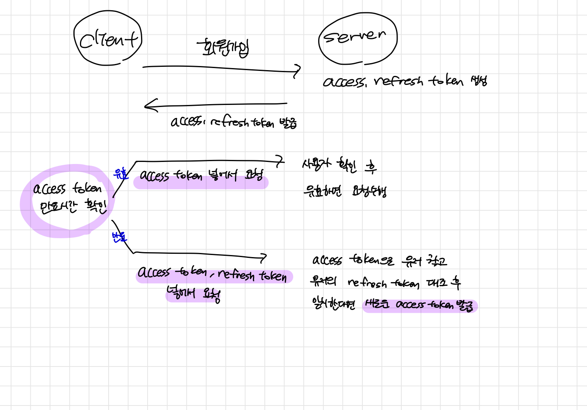

## 🌟 Refresh Token

## 🎯 JWT 인증과정

1. 회원가입 시 개발자가 설정한 정보를 토대로 액세스 토큰과 리프레시 토큰을 생성합니다.
2. 생성한 토큰을 반환합니다.
3. 클라이언트측에서는 액세스 토큰이 만료되지 않은 지 확인합니다.
   1. 만료되지 않았다면?
       - 액세스 토큰을 헤더에 넣어 서버측으로 요청을 보냅니다.
   2. 만료 되었다면?
       - 액세스 토큰과 리프레시 토큰을 서버측으로 보냅니다.
       - 서버는 받은 액세스 토큰으로 사용자를 식별합니다.
       - 해당 사용자의 리프레시 토큰과 클라이언트측에서 넘겨준 리프레시 토큰을 대조합니다.
       - 일치한다면 새로운 액세스 토큰을 생성하여 반환합니다.
   3. 리프레시토큰까지 만료되었다면?
       - 클라이언트에게 새로운 인증을 요구합니다. 
 

## 🎯  리프레시 토큰의 역할
인증기한이 만료된 사용자에게 새로운 액세스 토큰을 생성해줍니다.

## 🎯  장점
정보의 노출시간을 줄이는데에 의의가 있습니다.
JWT 특성상 권한을 위한 데이터가 모두 토큰안에 들어가있고, 발급하면 만료시까지 돌이킬 수 없기에
이를 탈취하여 디코드하는 경우 정보가 오랜시간 노출될 수 있어서 주의해야합니다.

때문에 권한정보를 담고있는 액세스토큰이 탈취되더라도 빠르게 만료시키고
리프레시 토큰으로 사용자를 재확인하여 발급하는 로직을 거치는 것이 필요합니다.

이렇게 되면 토큰이 탈취되더라도 금방 만료되고 리프레시 토큰은 노출되지 않기때문에 재발급을 막을 수 있다는 것과
지속적으로 정보를 노출시키지 않고 리프레시 토큰과 액세스토큰이 서버로 전해지는 짧은 순간만 노출시키면 된다는 장점이 있습니다.

## 🎯  단점
세션과 쿠키에 비하자면 서버입장에서 저장소가 따로 필요하진 않지만 
요청 횟수나 검증과정이 많아집니다. 또한 길이가 길어 서버 자원을 낭비할 수 있습니다.