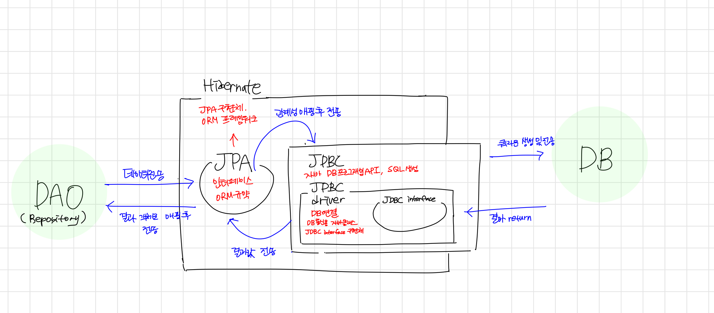

## 🌟 Spring JPA

## 🎯 JPA란?
자바에서 제공하는 API임과 동시에 ORM 기술 표준입니다. 
(ORM에 대한 설명은 파이썬 카테고리의 ORM이란? 이라는 글을 참고해주세요) 
인터페이스이므로 JPA가 직접 동작하는게 아니라  
Hiberante과 같은 ORM 프레임워크를 구현하여 사용합니다. 
객체와 관계형DB 데이터를 자동으로 매핑해주어 '관계'를 객체 내에 반영하는 것이 목적입니다. 

## 🎯 JPA 동작방식

## 🎯 JPA를 사용하게 되면?
JPA를 사용하게되면 일단 쿼리를 직접적으로 생성하지 않아도 되니  
상대적으로 간편하게 느껴집니다.(쿼리문은 자동생성되니까) 
또한 필드에 변화가 생겨도 쿼리문을 하나하나 수정할 필요가 없으므로 생산성또한 향상됩니다.  이렇게 되면 유지보수할때도 훨씬 편할 것 입니다.  
다만 자동생성된 쿼리가 제대로 동작하지않을때는 쿼리문을 까봐야하는데  
이때 SQL을 잘 모른다면 아무래도 문제를 해결하는데 어려움을 겪을 수 있습니다.  
그니까 ORM 쓰더라도 SQL 공부는 어쨌든 열심히 합시다ㅎㅎ  

https://armful-log.tistory.com/67
https://velog.io/@adam2/JPA%EB%8A%94-%EB%8F%84%EB%8D%B0%EC%B2%B4-%EB%AD%98%EA%B9%8C-orm-%EC%98%81%EC%86%8D%EC%84%B1-hibernate-spring-data-jpa