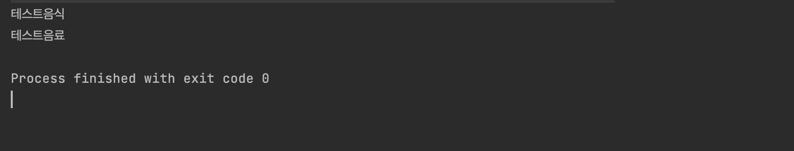

## 🌟 Factory method pattern

## 🎯 팩토리 메서드 패턴이란?
팩토리 메서드 패턴은 객체 생성 처리를 서브클래스로 분리하는 패턴입니다.<br>
객체를 만들어 내는 공장역할을 할 자식클래스를 만든다고 이해하시면 됩니다.<br>
서브클래스는 어떤 클래스의 객체를 생성할건지에 대해 결정합니다.<br>

## 🎯 사용하는 이유
객체 지향 디자인은 기본적으로 쉽게 확장할 수 있으면서 동시에 수정은 잦지 않아야합니다.<br>
따라서 수정이 불가피할 경우를 대비하여 자주 수정될 것 같은 부분과<br>
크게 변하지 않을 부분을 분리하는 것이 좋습니다.<br>
이떄 객체 생성 기능은 필드가 변화하거나 메소드가 변화할 가능성이 큰 편이라<br>
생성을 담당하는 부분을 분리하여 결합도를 낮출 필요성이 있습니다.<br>
<br>
+) 결합도(의존성)란?<br>
서로 다른 모듈끼리 연관되어있는 정도를 뜻합니다. <br>
많이 연결되어있을수록 하나를 수정하면 그와 연관된 많은 것들을 수정해야하는 대참사가 일어납니다.<br>
완전히 없애는건 가능한지 모르겠고(아마 어려울 것 같다는...느낌...)  <br>
낮을수록 좋으므로 최대한 낮추려고 해봅시다!<br>
<br>
팩토리 메서드 패턴을 사용하면 <br>
생성과 관련된 정보를 분리하여 관리하므로 결합도가 낮고<br>
생성기능을 부모클래스에 노출시키지 않음으로서 캡슐화까지 가능하단 점에서 이득입니다.<br>

## 🎯 대략적인 예제
본 예제에선 슈퍼클래스 Item 과 서브클래스 drink, food로 나뉩니다.<br>
<br>

1. 일단 슈퍼 클래스부터 만들어줍니다. 

```java
@Entity
@NoArgsConstructor
@Getter
public abstract class Item{

    @Id
    @GeneratedValue(strategy = GenerationType.IDENTITY)
    private Long id;
    private String name;

    public Item(String name){
        super();
        this.name = name;
    }
}
```

2. 서브 클래스도 만들어줍니다.

```java
@Entity
@Getter
@NoArgsConstructor
public class Food extends Item {
    public Food(String name) {
        super(name);
    }
}

@Entity
@Getter
@NoArgsConstructor
public class Drink extends Item {
    public Drink(String name) {
        super(name);
    }
}
```

3. 팩토리 클래스를 추상클래스로 만들어준 뒤 내부에 추상메소드를 정의합니다.

```java
public abstract class ItemFactory{
    public abstract Item create(String type,String name);
}
```

4. 추상클래스를 구현해줍니다. <br>
객체생성시 타입별로 구분해서 서로 다른 객체를 생성합니다.

```java
public class ItemCreate extends ItemFactory{
    @Override
    public Item create(String type, String name){
        switch(type){
            case "food":
                return new Food(name);

            case "drink":
                return new Drink(name);

            default:
                throw new RuntimeException("type is not exist");

        }
    }
}
```

5. 테스트 해봅니다.

```java
public class TestFactory {

    public static void main(String[] args) {
        ItemCreate itemCreate = new ItemCreate();
        Item testFood = itemCreate.create("food","테스트음식");
        Item testDrink = itemCreate.create("drink","테스트음료");
        System.out.println(testFood.getName());
        System.out.println(testDrink.getName());
    }

}
```
<br>
결과는 다음과 같이 객체가 생성되어 나옵니다!<br>



<br>
<br>
https://jdm.kr/blog/180<br>
https://velog.io/@ellyheetov/Factory-Pattern<br>
https://readystory.tistory.com/117<br>