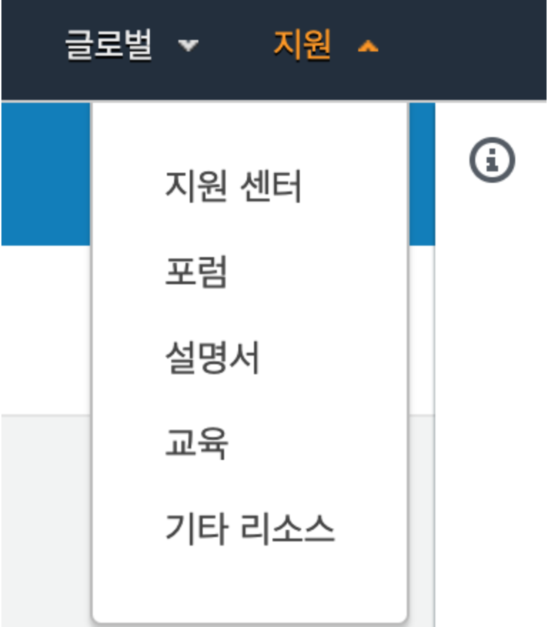
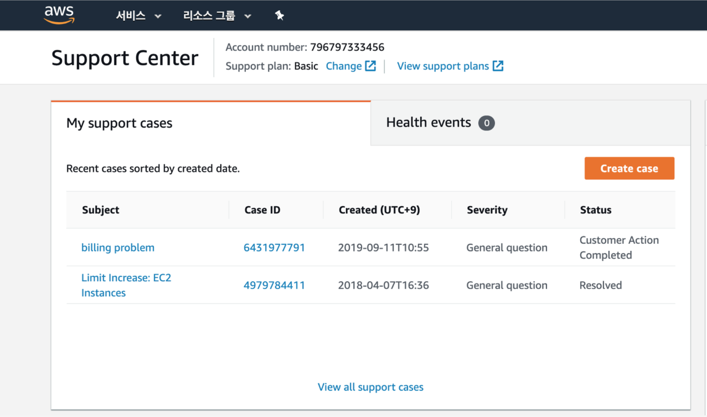
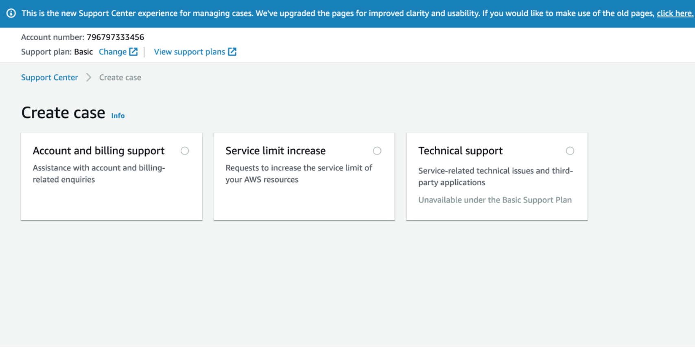
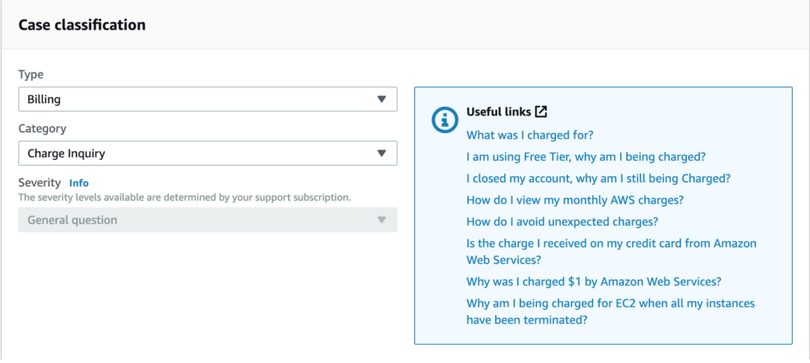
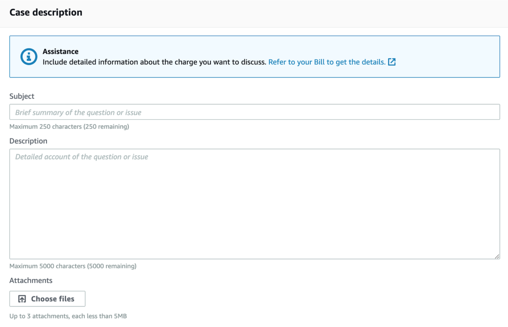
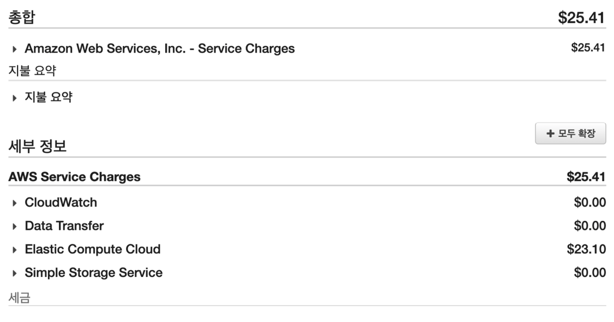
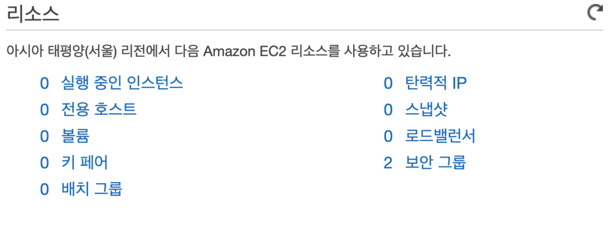
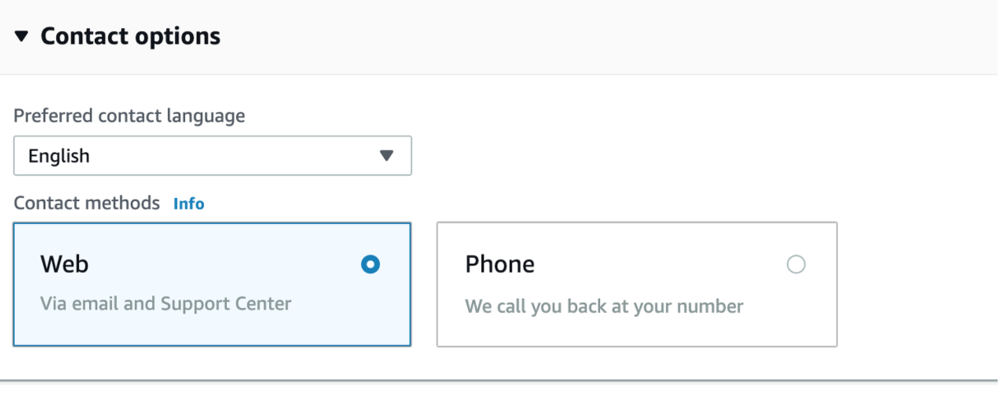

⚠️ **본 포스팅은 2019.10.10 에 작성된 포스팅을 백업한 것이므로
실제 AWS 웹 화면이 첨부이미지와 다를 수 있습니다**

## 🌟AWS 해킹 및 실수로 인한 청구 해결하기

저번달에 aws에서 과금문제가 발생했었다.
내가 사용하는 리전에는 인스턴스가 하나도 없는거보면 내 과실은 아니란 얘기고 
아마 플젝 배포하면서 키가 노출되지 않았나 싶었다.

보통 이런건 크게당하면 백만원에서 천만원단위 까지 털리기도 하던데 난 학생이라 불쌍했는지 3만원 썼더라.

환불받을 기회는 한번뿐이라 적게 쓰면 그냥 돈 내고 마는 사람들도 있긴한데
괜히 털린게 찝찝해서 한번 환불받고 계정을 닫을 각오로 문의를 보냈다.

### 🎯 AWS 접속시 오른쪽 상단 맨 끝에 지원을 누르면 지원센터 클릭

### 🎯 create case(주황버튼)을 클릭

### 🎯 account and billing support 로 선택

### 🎯 case classification Type -> Billing / Category -> Charge Inquiry 선택
다른 카테고리도 많긴했는데 난 모르겠어서 그냥 저걸로 했었다. 환불 된거보면 별 상관은 없는 듯 하다
    

### 🎯 결백하다는 (or 실수했다는) 호소문 작성

간단하게 작성해도 된다. 예시로 내가 쓴걸 들자면 

> 안부인사
> 나 한국의 학생인데 빌지보고 겁나 놀랐다. 
> 교육목적으로 1시간 쓰고 다 지웠는데 청구가 됐더라,
> 자주쓰는 리전 확인도 해봤는데 아무것도 없다 등등 상황설명
> 내가 시도했던 것들 나열..
> 다른사람이 내 계정을 쓰고있는 것 같은데 어떻게 해야함?

딱 알아먹을 수 있을 정도로만 썼는데 불쌍해보여서 효과가 좋았던 것 같다.
간혹가다가 너무 유려하게 쓰면 환불안해준다는 말도 있으니 
내가 영어를 좀 한다 싶으면 적당히 띨띨해보이게 쓰는걸 추천한다.

첨부파일 넣어주면 더 좋단 소리가 있어서  청구서 + 자주 썼던 리전의 EC2 리소스목록 요렇게 두장 넣어줬다.

### 🎯컨택방법 선택하기

web 선택시 이메일, phone 선택시 전화로 해결책을 알려준다.
나는 web으로 선택했는데 한 네다섯시간 후에 전화도 왔다. 
번호가 거진 스팸전화처럼 오는데 그거 AWS 맞으니 안심하고 받으면 된다. 
처음받으면 갑작스런 영어에 뇌가 1차 충격받고 그와중에 소리가 끊겨서 2차 충격을 받게되지만
그래도 누가 언어는 기세라고 했다. 쫄지말고 들어보자.
나는 전화받았을때 본인확인+계정으로 메일이랑 메세지 (my support case에서 제출한 문의제목 클릭하면 볼 수 있음.) 보낼테니 시도해보고 연락주라는 것 같아서 응응 오케이~하고 끊었다.

### 🎯메세지(메일) 따라하기
사람마다 메세지 내용이 다르니까 각자 따라해보고
다했다고 답하면 뭘 더하라느니 아니면 이제 됐으니 기다리라는 회신이 온다.
그럼 존버하면된다. 청구서는 거의 바로..아님 하루? 정도 걸리고 입금은 한 3~5일정도 지나면 들어온다.
안되면 언제쯤 처리되느냐고 메세지 보내면 기다리라는 답변이 올거다.
어차피 기다리라곤 하겠지만 그래도 재촉하면 괜히 빨리 되는 듯한 기분이 들어서 마음이 풀어지니 
만일 좀 걱정된다 싶으면 망설이지말고 보내보는걸 추천한다.

