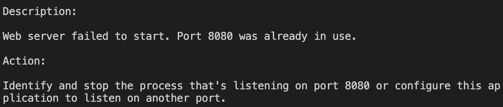

## 🌟 스프링 개발환경 구축하기(MAC + VScode + SpringBoot)
**❗ 들어가기에 앞서 전 Vscode로 개발하다가...이런저런 편의성이 부족하다고 느껴 <br> 현재는 이클립스로 넘어갔습니다..ㅎ**

### 🎯 어떤걸 설치해야 하는가?
1. Vscode - 에디터
2. Java Extension Pack - 언어
3. Maven for Java - 빌드도구 
4. Tomcat for Java - WAS
5. Spring Boot Extension Pack - 프레임워크 관리

### 🎯 Vscode - 에디터
https://code.visualstudio.com/<br>
다음링크로 들어가서 Download for Mac을 눌러
좀 기다리다가 일반 어플리케이션 깔듯이 설치해줍니다.
설치를 다 하고 Vscode를 실행해보면 시커멓고 예쁜 화면이 나오는데, 맨 오른쪽에 이 이 아이콘을 클릭합니다.

나타난 탭은 확장 라이브러리를 설치할 수 있는 마켓입니다. 
이제부터 여기다가 여러가지 라이브러리를 붙여 스프링 개발환경을 구축해 볼 것입니다.

### 🎯 Java Extension Pack
Java Extension Pack 컴퓨터 내에 `자바를 설치해주는 패키지`입니다.
+JDK는 아마 내가 안드하면서 예전에 설정한 듯해서 설명은 생략

### 🎯 Maven for Java
Maven은 프로젝트 내에서 생성, 컴파일, 테스트, 정적분석, 의존성 관리등을
자동으로 실행하여 개발자들의 부담을 덜어주는 `빌드도구`입니다. 
Maven을 통해 사용자가 작성한 소스코드 내의 파일과 자원을 실행가능한 
즉, 웹 어플리케이션 서버가 인식할 수 있는 소프트웨어 형태로 변환하고 실행할 수 있습니다.

설치하고 경로설정하기
### 🎯 Tomcat for Java 
#### 🎯 Web server & WAS
**클라<->웹서버<->WAS<->DB**
`Web server`는 클라이언트에게 요청을 받아 정적 컨텐츠를 제공하는 서버입니다. 
또한 동시에 클라이언트에게서 들어온 동적 컨텐츠 제공 요청을 WAS에게 전달합니다.
이때 요청을 받는 `WAS`(웹 컨테이너,서블릿 컨테이너)는 동적인 웹을 만들기 위한 어플리케이션 서버입니다.
요청받은 동적 데이터들을 처리하여 정적 페이지로 생성해주는 역할을 합니다. 
WAS는 동적과 정적 자원을 둘 다 지원할 수 있으나 
웹 서버에서 정적 컨텐츠만, WAS는 동적 컨텐츠만 관리하게하면 
처리할 데이터가 분리되면서 서버의 부하를 줄일 수 있습니다.

톰캣은 WAS의 일종으로 작성한 소스코드의 동적인 데이터처리를 지원하기 위하여 
사용합니다. spring boot에 내장되어있어 따로 설정할 것은 없습니다.

### 🎯 Spring Boot Extension Pack
스프링 부트란 스프링 프레임워크를 간단하게 설정, 관리 할 수 있는 스프링 프로젝트입니다.
애플리케이션을 보다 쉽게 생성할 수 있으며 
Tomcat을 내장하고있어 애플리케이션 실행도 가능합니다. 


### 🎯 자질구레한 에러

세팅을 마치고 런서버를 해보니 8080포트를 이미 사용하고 있다는 안내문구가 나왔습니다. 아마 뷰에서 깔짝거려둔게 아직도 안죽고 살아있는 모양인데
간단하게 다음의 명령어로 해결했습니다. 
```java
netstat -anv //포트번호 확인
sudo lsof -i :"포트 번호"
sudo kill -9 "프로세스 번호"  
```


