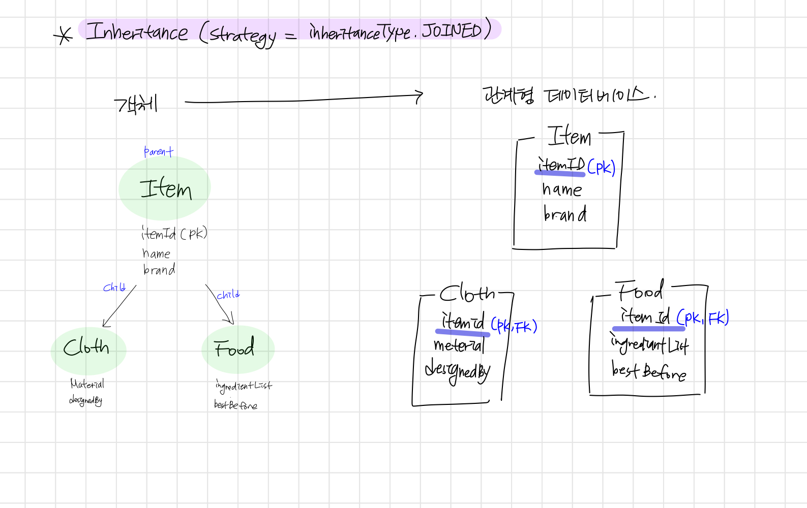
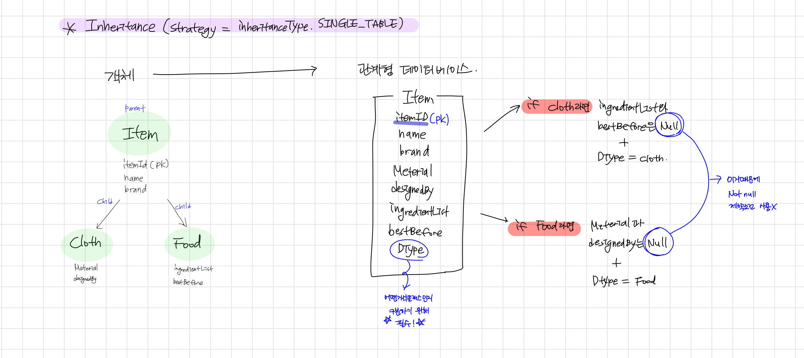
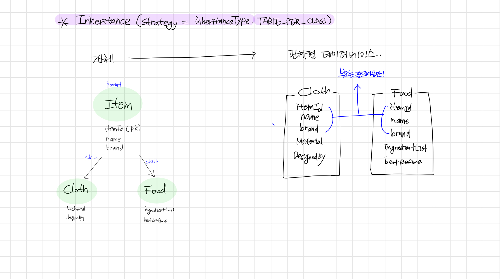

## 🌟 JPA inheritance mapping

## 🎯 상속관계 매핑이란?
객체사이애서 존재하는 상속이라는 개념을 관계형 데이터베이스에 적용시키는 것 입니다. 
엄밀히 말하자면 관계형 데이터베이스에서는 상속이란 개념을 지원하지 않으므로 
슈퍼타입, 서브타입 모델링 기법을 이용하여 유사한 기능을 하게끔 하는 것입니다. 

## 🎯 JPA에서의 매핑전략
JPA에서는 총 세가지의 상속관계 매핑 전략을 지원합니다. 
@Inheritance(strategy = InheritanceType.전략명) 으로 정의할 수 있습니다. 

1. 조인 전략(JOINED)

부모클래스와 자식클래스 둘다 테이블을 생성합니다. 
 
부모클래스(슈퍼타입) : PK + 자식에게도 공통으로 적용될 필드 
자식클래스(서브타입) : 부모의 PK(FK로 저장, 부모와 연결) + 자식 고유의 필드 
 
장점으로는 가장 정규화된 형태로 저장하므로 저장공간 효율성이 좋으며 
참조무결성 제약조건을 활용하므로 안정성이 높다는 점이 있습니다.  
따라서 규모가 크거나, 차후에 확장가능성이 있는 시스템에 적합합니다. 
단점으로는 SELECT 시 내부조인을 하여 불러오므로  
(슈퍼의 PK + 서브의 PK FK값) 상대적으로 성능이 떨어질 수 있고 
INSERT 시 같은 데이터정보를 테이블 두개에 넣어야하므로 
쿼리문이 2배가 된다는 점이 있습니다. 
 

2. 단일 테이블 전략(SINGLE_TABLE)

부모클래스만 테이블로 생성하여 모든 정보를 저장합니다. 

 
부모클래스(슈퍼타입) : 자식클래스 필드들 + 구분자(Dtype) 
 
장점으로는 SELECT시 따로 하는 작업이 없어 성능이 가장 좋고 
직관적인 방법이라 사용하기 쉽다는 점이 있습니다. 
따라서 상대적으로 복잡하지 않고 데이터도 많지 않은 시스템에 적합합니다. 
단점으로는 자식클래스인 서브타입에 들어가는 필드들은 null값을 허용해야하고 
하나의 테이블이므로 데이터가 많아지면 복잡해진다는 점이 있습니다. 
 

3. 구현 클래스 테이블 전략(TABLE_PER_CLASS)

부모클래스는 공통필드만 제공하고 자식클래스만 테이블로 생성합니다. 

자식클래스(서브타입) : 부모에서 제공하는 공통필드들 + 자식 고유의 필드들 

장점으로는 단일테이블에 없는 Not null 조건을 사용할 수 있다는 점이 있습니다. 
단점으로는 한번에 여러 자식테이블을 조회할때 UNION을 사용한다는 점이 있습니다. 
동작방식이 비효율적이고 쿼리문이 복잡해지는 경우도 많아 잘 쓰지 않는 전략입니다. 

## 🎯 MappedSuperClass
앞서 말햇던 구현클래스 테이블 전략처럼 부모클래스에서  
공통으로 정의되는 필드만 상속받아오고 싶을 때 사용합니다. 
부모클래스 위에 @MappedSuperClass를 선언하여 사용합니다. 
단순히 필드값만 제공하므로 상속관계 매핑이라 할 수 없고 
조회나 검색이 불가능하여 Generic repository를 만들 수 없는 특징이 있습니다. 

