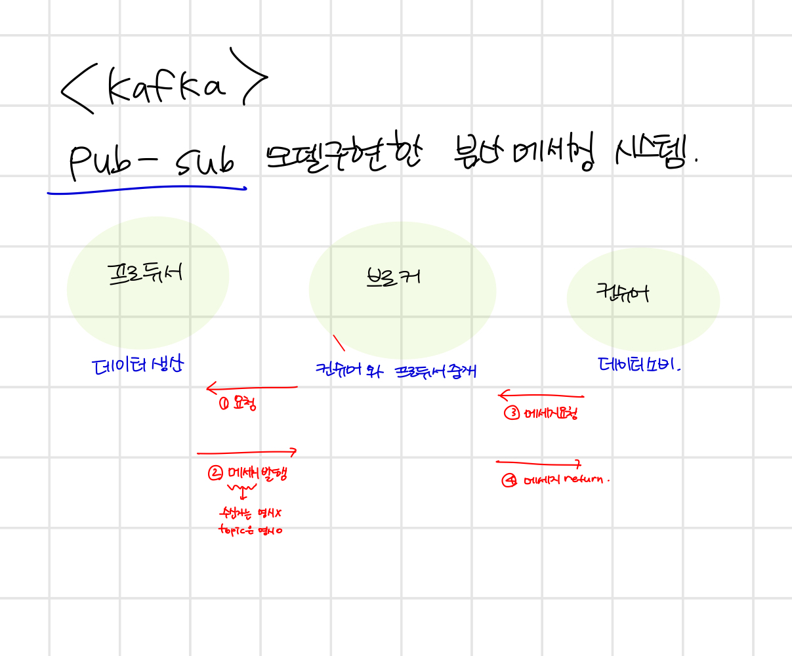
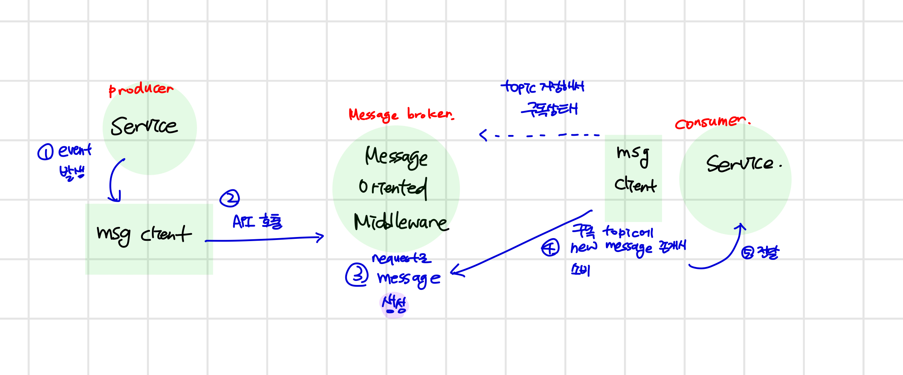

## 🌟Messaging system

### 🎯 메세징 시스템이란?
독립된 어플리케이션끼리 API를 통해 송수신하게 되는데, 이때 데이터를 메세지형태로 처리하는 시스템입니다. 
비동기로 메세지를 전달하는 것이 특징이며 메세지 발행자인 producer와 소비자인 consumer으로 구성되어있습니다.

### 🎯 pub/sub 구조

 

### 🎯 동작구조

 
https://victorydntmd.tistory.com/343